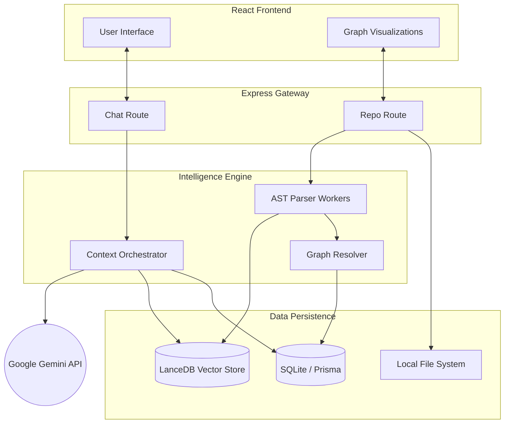

# System Architecture

This document provides a comprehensive overview of the AI-Developer Copilot architecture. It details the modular design, the execution pipeline, and how deterministic data structures interface with semantic AI components to deliver deep codebase intelligence.

---

## 🧩 Core Modules

### Parser
The **Parser Module** is the foundational data extraction layer. It utilizes Babel (`@babel/parser`, `@babel/traverse`) to break down source code into Abstract Syntax Trees (AST). To prevent blocking the main Node.js event loop during intensive AST traversal of large repositories, the parser is strictly executed within isolated background **Worker Threads**. It extracts key metadata such as modules, functions, classes, routes, and their specific line-range locations.

### Graph
The **Graph Module** is responsible for establishing deterministic relationships between the parsed symbols. It performs cross-file alias resolution, tracks CommonJS `require` and ES6 `import` chains, and binds function callers to their respective callees. This module transforms isolated files into a highly interconnected network of dependencies, enabling sophisticated downstream and upstream tracing.

### Context
The **Context Orchestrator** bridges the gap between raw backend data and the Large Language Model (LLM). When a user submits a query, this module classifies the intent (e.g., blast radius vs. semantic search) and dynamically injects the most relevant deterministic graph data, route execution flows, and semantic code chunks into the final prompt context, preventing LLM hallucinations.

### LanceDB
**LanceDB** serves as the system's local semantic Vector Store. During the ingestion pipeline, source code is chunked, embedded into high-dimensional vectors, and stored in LanceDB. This allows the Copilot to handle conceptual, natural-language queries by retrieving code blocks based on semantic similarity rather than strict keyword matching.

### SQLite (Prisma)
**SQLite** acts as the primary relational database, managed by the Prisma ORM. It provides rapid, structured querying capabilities. It stores:
- Repository and File metadata (including SHA-256 hashes for delta indexing).
- Extracted Code Symbols.
- The Knowledge Graph edges (Symbol Relationships, execution orders, and resolution confidences).

### Routes
The **Express Routes** form the API Gateway connecting the frontend to the intelligence engine. 
- The **Repo Router** handles asynchronous cloning, initiates the background indexing pipelines, and serves raw file trees and graph topologies.
- The **Chat Router** serves as the interactive AI endpoint, coordinating the Context module and LLM responses.

### Frontend
The **Frontend Layer** is a React 19 Single Page Application (SPA) bundled with Vite and styled with TailwindCSS v4. It emphasizes rich data visualization over static text, employing libraries like `reactflow` and `react-force-graph-2d` to render dynamic architecture graphs, execution flows, and interactive file explorers.

---

## ⚙️ Execution Pipeline

When a new repository is submitted for ingestion, it undergoes a rigid, multi-pass background pipeline:

1. **Extraction (Pass 1)**: Files are scanned and dispatched to Worker Threads where AST parsing extracts raw symbols.
2. **Import Binding (Pass 1b)**: The module graph is formalized by linking relative imports, aliases, and external dependencies.
3. **Call Graph Resolution (Pass 2)**: Function invocations are resolved across files to determine exactly which symbol is calling which, establishing upstream and downstream links.
4. **Middleware Chaining (Pass 2b)**: API routes are analyzed to build sequential execution paths across multiple middleware and controllers.
5. **Semantic Embedding (Pass 3)**: Code is chunked and synced to LanceDB for dense vector retrieval.

---

## 🧠 Knowledge Graph

The **Knowledge Graph** is the culmination of Passes 1 and 2. Stored relationally in SQLite, it models the entire codebase as a directed graph. 
- **Nodes** are Code Symbols (Functions, Classes, Routes, Modules).
- **Edges** are deterministic relationships (`calls`, `imports`, `reexports`).
Each edge includes a **confidence score** representing the certainty of the resolution (e.g., local scope resolution is 1.0, while global fallback resolution might be 0.35).

---

## 💥 Impact Analysis (Blast Radius)

Leveraging the Knowledge Graph, the system performs **Impact Analysis**. By traversing the graph upstream (`callers`) and downstream (`callees`), the engine can deterministically predict the cascading effects of modifying a specific function or module. This allows developers to instantly visualize which routes, controllers, or database models might break if a targeted piece of code is altered.

---

## 🔄 Data Flow

1. **User Request**: User queries the AI via the Frontend.
2. **Intent Classification**: The Backend determines if the query requires graph traversal, semantic lookup, or structural summaries.
3. **Graph Traversal**: For deterministic queries, the system traverses SQLite edges to find callers/callees.
4. **Vector Lookup**: For semantic queries, the system retrieves visually similar code chunks from LanceDB.
5. **Context Assembly**: The Context Module packages the structural and semantic data together.
6. **LLM Generation**: Gemini processes the highly-enriched context and streams an accurate, hallucination-free response back to the Frontend.

---

## 📊 Dependency Diagram

